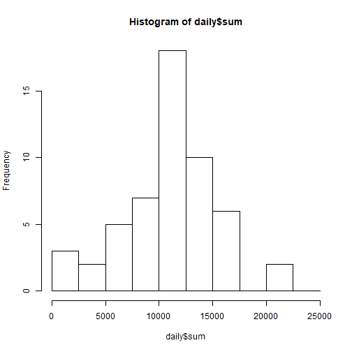
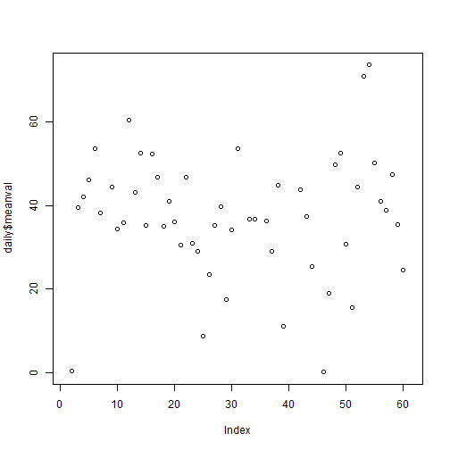
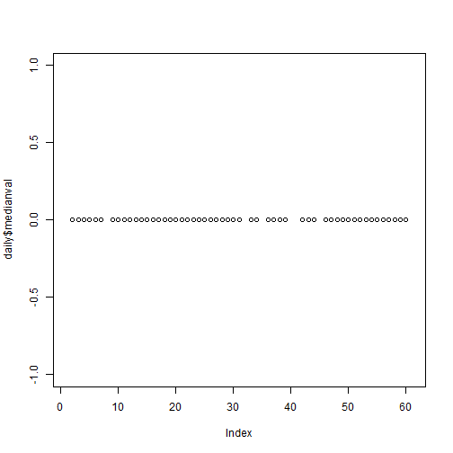
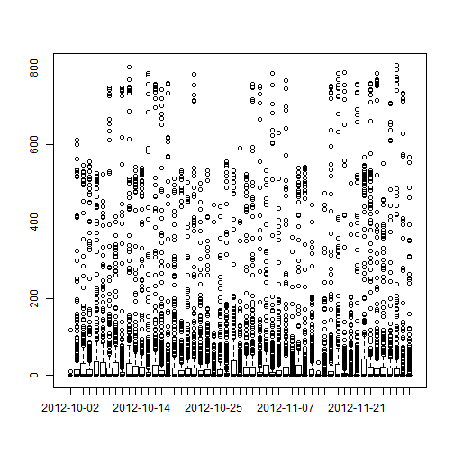
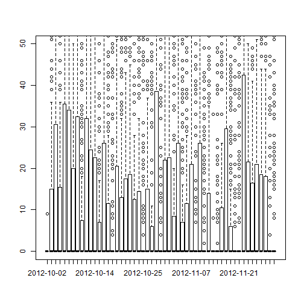
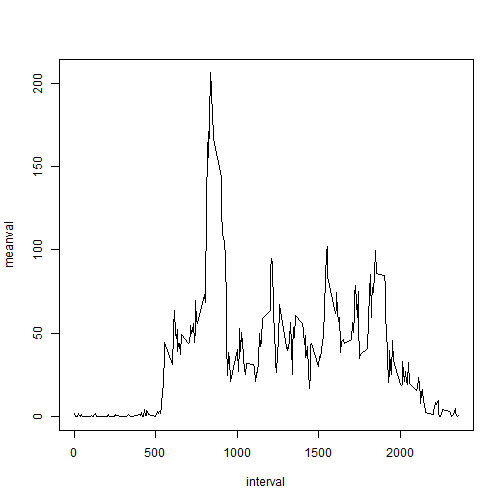
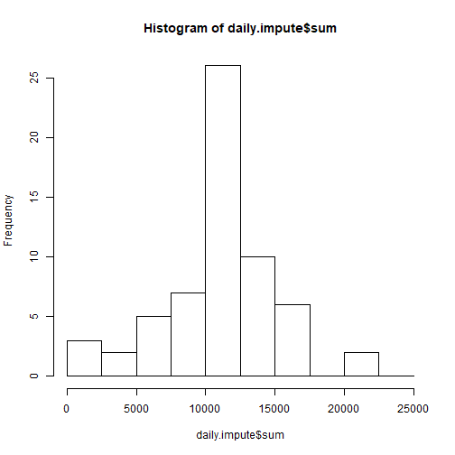
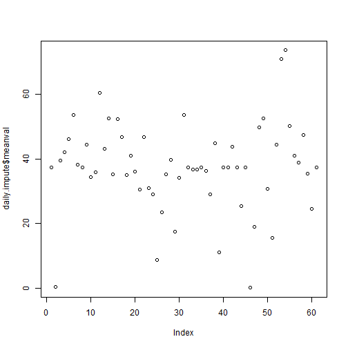
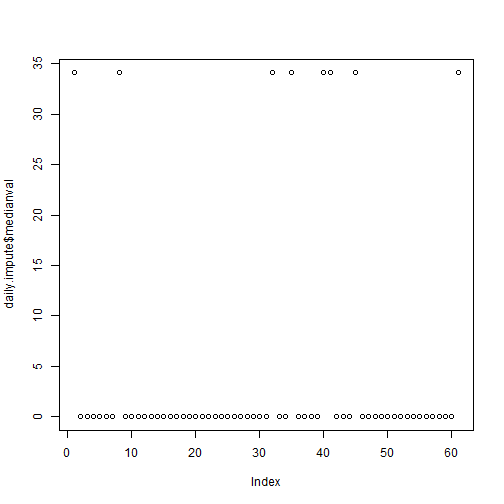
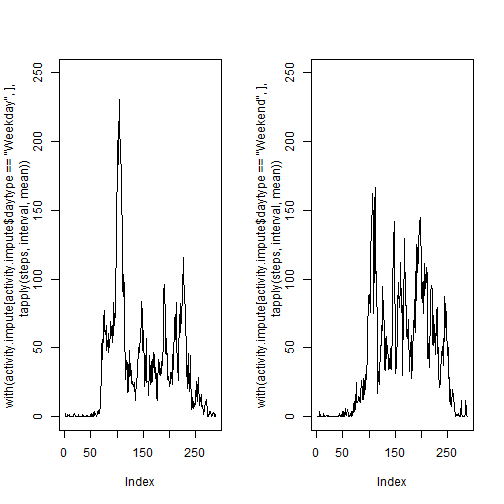

## Introduction

In this analysis we take a dataset for one anonymous individual from a personal activity monitoring device.
The data consists of the number of steps per 5-minute interval, for each day in October and November, 2012.

## Loading and preprocessing the data

Load the data from the online source, if not already downloaded


```r
remotefile <- "https://d396qusza40orc.cloudfront.net/repdata%2Fdata%2Factivity.zip"
zipfile <- "data\\activity.zip"
localfile <- "activity.csv"
if(!file.exists(".\\data")) {dir.create(".\\data")}
if(!file.exists(zipfile)) {download.file(remotefile, zipfile)}
activity <- read.csv(unz(zipfile, localfile))
```

The date is in character format so we need to change it to a date.


```r
activity$date <- as.POSIXct(activity$date, format="%Y-%m-%d")
```

## What is mean total number of steps taken per day?


```r
daily <- as.data.frame(unique(activity$date))
names(daily) <- "date"
```

Calculate the total number of steps taken per day

```r
daily$sum <- with(activity, tapply(steps, date, sum))
```

Make a histogram of the total number of steps taken each day

```r
hist(daily$sum, breaks=seq(0,25000,2500))
```



Calculate and report the mean and median of the total number of steps taken per day

```r
daily$meanval <- with(activity, tapply(steps, date, mean))
daily$medianval <- with(activity, tapply(steps, date, median, na.rm=T))
```
Here is the mean plotted for each day

```r
plot(daily$meanval)
```



Here is the median plotted for each day

```r
plot(daily$medianval)
```



That doesn't look right... let's try a boxplot

```r
boxplot(activity$steps ~ activity$date)
```



It looks like the medians are all zero but let's zoom in to verify

```r
boxplot(activity$steps ~ activity$date, ylim=c(0,50))
```




## What is the average daily activity pattern?

Make a time series plot (i.e. type = "l") of the 5-minute interval (x-axis) and the average number of steps taken, averaged across all days (y-axis)

```r
intervals <- as.data.frame(unique(activity$interval))
names(intervals) <- "interval"
intervals$meanval <- tapply(activity$steps, activity$interval, mean, na.rm=TRUE)
with(intervals, plot(interval, meanval, type="l"))
```



Which 5-minute interval, on average across all the days in the dataset, contains the maximum number of steps?

```r
intervals[which.max(intervals$meanval),]
```

```
##     interval  meanval
## 104      835 206.1698
```

## Imputing missing values

Calculate and report the total number of missing values in the dataset (i.e. the total number of rows with NAs)

```r
sapply(seq_along(names(activity)),function(x) sum(is.na(activity[,x])))
```

```
## [1] 2304    0    0
```

Devise a strategy for filling in all of the missing values in the dataset. The strategy does not need to be sophisticated. For example, you could use the mean/median for that day, or the mean for that 5-minute interval, etc.
> Missing values to be replaced by average for that interval across all days]  
Create a new dataset that is equal to the original dataset but with the missing data filled in.

```r
library(dplyr)
activity.impute <- activity %>%
	group_by(interval) %>%
	mutate(steps = replace(steps, is.na(steps), mean(steps, na.rm=TRUE)))
```

Make a histogram of the total number of steps taken each day

```r
daily.impute <- as.data.frame(unique(activity.impute$date))
names(daily.impute) <- "date"
daily.impute$sum <- with(activity.impute, tapply(steps, date, sum))
hist(daily.impute$sum, breaks=seq(0,25000,2500))
```



Calculate and report the mean and median total number of steps taken per day

```r
daily.impute$meanval <- with(activity.impute, tapply(steps, date, mean))
daily.impute$medianval <- with(activity.impute, tapply(steps, date, median, na.rm=T))
plot(daily.impute$meanval)
```



```r
plot(daily.impute$medianval)
```



```r
boxplot(activity.impute$steps ~ activity.impute$date)
```


Do these values differ from the estimates from the first part of the assignment?
> Yes  

What is the impact of imputing missing data on the estimates of the total daily number of steps?
> The total daily number of steps increases as there are now more non-zero step counts

## Are there differences in activity patterns between weekdays and weekends?

Create a new factor variable in the dataset with two levels – "weekday" and "weekend" indicating whether a given date is a weekday or weekend day

```r
activity.impute$wkd <- weekdays(activity.impute$date, abbreviate=TRUE)
activity.impute$daytype <- as.factor(ifelse(activity.impute$wkd == "Sat" | activity.impute$wkd == "Sun", "Weekend", "Weekday"))
```

Make a panel plot containing a time series plot (i.e. type="l") of the 5-minute interval (x-axis) and the average number of steps taken, averaged across all weekday days or weekend days (y-axis)

```r
par(mfcol=c(1,2))
plot(with(activity.impute[activity.impute$daytype=="Weekday",], tapply(steps, interval, mean)), type="l", ylim=c(0,250))
plot(with(activity.impute[activity.impute$daytype=="Weekend",], tapply(steps, interval, mean)), type="l", ylim=c(0,250))
```



It appears that there is a difference in mean step activity per time interval between weekdays and weekends
